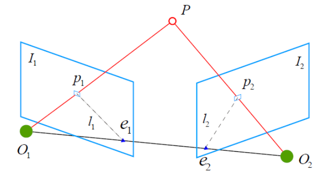
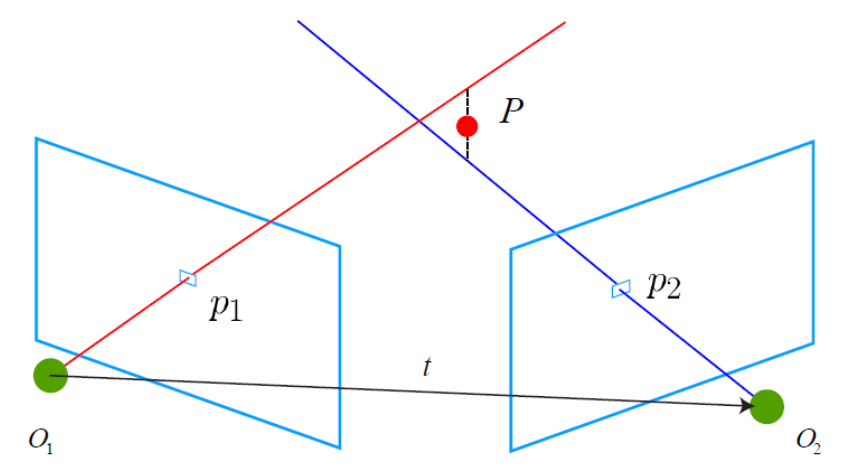
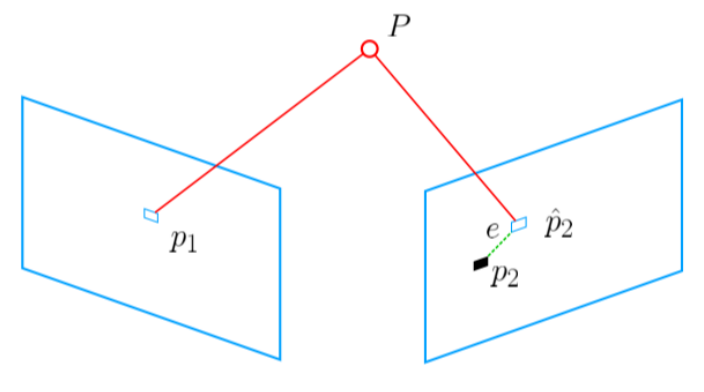

# 特征点方法求解R和t

## 1、2D-2D 对极几何

问题描述：

已知两张图片中的多组匹配点，求解相机的运动R和t。

### 数学建模

$$
x_2^{T}t^{\wedge}Rx_1=0 \\
(sp = KP) \\
p_2^{T}K^{-T}t^{\wedge}RK^{-1}p_1=0
$$
其中，$p$为像素坐标，P为相机坐标系下的点，$K^{-1}p = \frac{1}{s}P=x$为归一化坐标。

### 求解思路：

八点法，求解本质矩阵$E=t^{\wedge}R$，然后在通过SVD分解求解出R和t，分解的结果一共有四组解，需要通过三角测量法恢复深度的方法来计算$s_1和s_2$然后从四组解里面计算出深度均为正的R和t。

## 2、三角测量恢复深度

问题描述：

已知运动R和t，求解特征点的3D位置。

### 数学建模

$$
s_1p_1=KP \\
s_2p_2=K(RP+t)\\
$$
其中，$p_1和p_2$为像素坐标，P为$O_1$相机下面的三维坐标点，令$x$为归一化坐标点，则$x=\frac{1}{s}P=K^{-1}p$。则
$$
s_1x_1=P\\
s_2x_2=RP+t ,则\\
s_2x_2=s_1Rx_1+t,两边同时叉乘x_2\\
s_2x_2^{\wedge}x_2=s_1x_2^{\wedge}Rx_1+t=0
$$
只需要一对点$p_1, p_2$即可求出$s_1，s_2$，即恢复了3D点的深度。

## 3、3D-2D PnP

问题描述：

已知3D点的世界坐标$P$和相机上的投影坐标$p$，求解相机运动R和t。

常见解法：

1、代数解法：DLT，P3P，EPnP...

2、优化解法：Bundle Adjustment（重要）

由于3D世界点和相机坐标点，往往是有噪声的，因此代数的解法经常不能得到解，优化解法是主要解法。

### 代数解法(DLT)

DLT: Direct Linear Transform

#### 问题描述

已知：

空间点坐标: $P=(X,Y,Z,1)^{T}$，

投影点坐标: $x=(u,v,1)^T$归一化坐标，等于$K^{-1}p$，$p$为像素坐标，

投影关系为: $sx=[R|t]P$，展开为
$$
s
\begin{bmatrix}
   u \\
   v \\
   1 
  \end{bmatrix}
=
\begin{bmatrix}
   t_1 & t_2 & t_3 & t_4\\
   t_5 & t_6 & t_7 & t_8\\
   t_9 & t_{10} & t_{11} & t_{12}
  \end{bmatrix}

 \begin{bmatrix}
   X \\
   Y \\
   Z \\
   1 
  \end{bmatrix} \tag{1}
$$
求：相机运动R和t。

#### 求解步骤

对(1)式最后一行展开，
$$
s=
\begin{bmatrix}
   t_9 & t_{10} & t_{11} & t_{12}
  \end{bmatrix}
\begin{bmatrix}
   X \\
   Y \\
   Z \\
   1 
  \end{bmatrix}
$$
用它消除前面两行的s，则一对特征点提供两个方程：
$$
t_1=[t_1,t_2,t_3,t_4]^T \\
t_2=[t_5,t_6,t_7,t_8]^T \\
t_3=[t_9,t_{10},t_{11},t_{12}]^T\\
$$
带入消元得到：
$$
t_1^TP-ut_3^TP=0 \\
t_2^TP-vt_3^TP=0 \tag{2}
$$
为求解12个未知数，需要12/2=6对点。（超定时求最小二乘解）

### 优化求解（BA）

问题描述与上面相同。

#### 解法思路：

1、最小化重投影误差。

2、投影关系：$s_ip_i=Kexp(\xi^{\wedge})P_i$

3、定义重投影误差并取得最小化：
$$
\xi^*=arg \space \underset{\xi}{min}\space \frac{1}{2}\sum{||p_i-\frac{1}{s_i}Kexp(\xi^{\wedge})P_i||^2_2}
$$
就是使用非线性优化的理论求解$\xi$的过程了。

## 4、3D-3D ICP

#### 问题描述：

已知：两个相机坐标系下的一组3D点$P和P^{'}$，求解相机运动从位置1到2的R和t。（一般情况下$R=R_{21},t=t_{21}$）。

设
$$
P=\{p_1,p_2,...,p_n\}，P^{'}=\{p_1^{'},p_2^{'},...,p_n^{'}\}，
$$
对于$\forall i$，满足
$$
\forall{i}，p_i=Rp_i^{'}+t
$$

#### 求解思路：

1、定义误差项：$e_i=p_i-(Rp_i^{'}+t)$

2、定义最小二乘问题：
$$
\underset{R,t}{min} \space J = \frac{1}{2}\sum_{i=1}^{n}||p_i-(Rp_i^{'}+t)||_2^2
$$

#### 算法Pros & Cons

1、在3D点有正确匹配关系的情况下，ICP算法有唯一解或者无穷多解(原地旋转)，使用代数方法，能找到解析解，使用优化方法和解析解的速度都很快。

2、在激光的情况下，匹配关系不一定正确，代数方法不能生效，只能使用优化算法。

